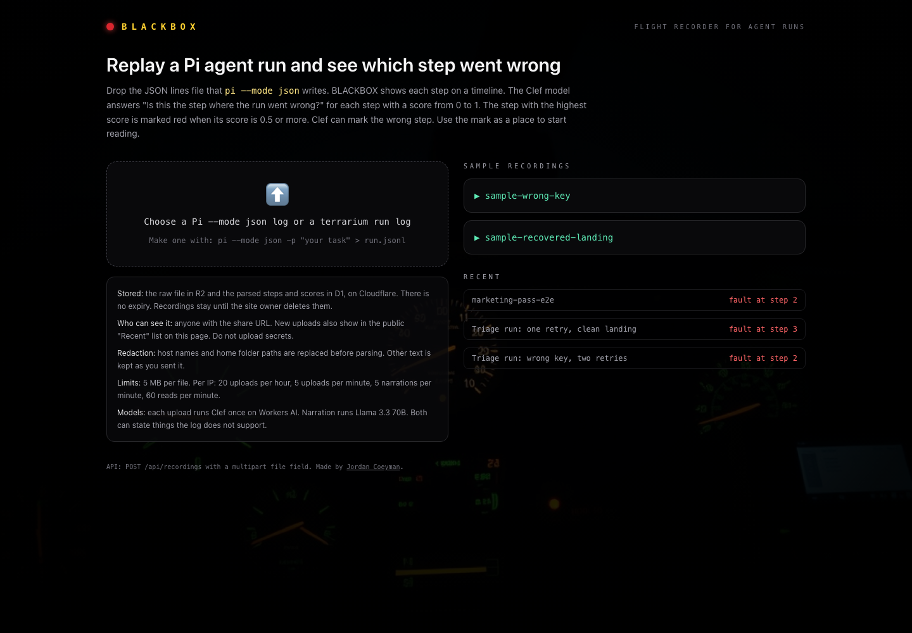

# BLACKBOX

BLACKBOX replays a Pi `--mode json` agent log as a step timeline and marks the step that the Clef model scores as the point where the run went wrong.

[](https://deploy.workers.cloudflare.com/?url=https://github.com/acoyfellow/blackbox)

Live at https://blackbox.coey.dev.



## How It Works

1. You upload a Pi `--mode json` log or a terrarium run log, up to 5 MB.
2. The front Worker `blackbox` checks the per-IP rate limit, then sends the request to the core Worker `blackbox-core` through a service binding.
3. The core replaces host names and `/Users/<name>` paths, then parses the events into steps: tool calls, assistant turns, and errors.
4. `@cf/cloudflare/clef`, called through AI Gateway `default`, answers "Is this the step where the run went wrong?" for each step with a score from 0 to 1. The step with the highest score is marked red if its score is 0.5 or more.
5. The core writes the raw log to R2 (`blackbox-logs`) and the steps and scores to D1 (`blackbox`), then returns a share URL `/r/<id>`.
6. On the replay page, NARRATE streams a short summary from `@cf/meta/llama-3.3-70b-instruct-fp8-fast` over SSE. The page renders it as plain text.

## Evidence

- `receipts/001-first-deploy.json`: first deploy and the Clef scores for both samples.
- `receipts/002-coey-dev.json`: split into front and core Workers on `blackbox.coey.dev`.
- `receipts/003-marketing-pass.json`: live checks after this pass, including one upload, one read, and one narration.
- `receipts/004-deploy-button.json`: the root config deployed as `blackbox-buttontest` with fresh D1 and R2, one real upload, then teardown.
- `receipts/lighthouse-mobile.json`: Lighthouse mobile run against the live site.
- `findings.md`: what Clef marked on the two sample runs. On `sample-wrong-key` it marked step 2 (p=0.54), the decision to skip the docs, and not the two error steps that came after it.

## Limits and Costs

- Upload size: 5 MB per file.
- Rate limits per IP: 20 uploads per hour (D1 count), 5 uploads per minute, 5 narrations per minute, and 60 reads per minute (Workers rate limit bindings).
- Visibility: anyone with a share URL can read the recording. The home page lists the 30 newest uploads. There is no login and no delete button.
- Retention: recordings have no expiry.
- Redaction covers host names and home folder paths only. Do not upload logs that contain secrets.
- Clef can mark the wrong step, and a score under 0.5 marks no step. The narrator can state wrong step numbers or causes.
- Cost: each upload runs Clef once per 64 steps, and each narration runs Llama 3.3 70B once on Workers AI. The site owner pays for both.

## Self-host

Click the Deploy button. It reads the root `wrangler.jsonc`, a single Worker (`src/standalone/index.ts`) that serves the UI and the API. It creates a D1 database and an R2 bucket in your account and binds Workers AI and three rate limits. Tables are created on the first request, so there are no migrations to run.

BLACKBOX needs no secrets. `vars.example` says so. If you add a secret later, set it with `bunx wrangler secret put NAME`.

The root config sets `workers_dev: true` because the button deploys into your own account and needs a URL. `.guardrailignore` lists `wrangler.jsonc` for that reason only: guardrail flags any public workers.dev Worker that has AI, D1, or R2 bindings. Anyone can upload, so the rate limits and your Workers AI quota are the only protection.

To deploy from a clone instead: `bun install && bun run deploy`.

Production on `blackbox.coey.dev` uses two Workers: `wrangler.prod.jsonc` (front: rate limits and assets) and `core/wrangler.prod.jsonc` (core: AI, D1, R2). `bun run deploy:prod` deploys core first, then front.

## Develop Locally

```
git submodule update --init
bun install
bun run verify
bun run build
bunx wrangler dev
```

API:

- `POST /api/recordings`: send a multipart `file` field or a raw body. Returns `{ id, url, failureIndex, steps }`.
- `GET /api/recordings/:id`: returns the recording view.
- `GET /api/recordings/:id/narrate`: streams the narration as SSE.

`samples/` contains two real Pi runs made by `bun run samples`, with host names, paths, and provider fields redacted.

`bun run verify` runs type checks, Biome, oxlint with the anti-slop rules (`tools/anti-slop` submodule), `scripts/copy-check.ts` (fails on banned copy phrases and the U+2192 arrow), and the tests.

## Stack

- Svelte 5, Tailwind CSS 4, Vite 8
- Cloudflare Workers (front and core), Workers AI, AI Gateway, D1, R2, Workers rate limit bindings
- Zod for every parse boundary
- Bun for tests and scripts

## License

MIT. See `LICENSE`.
